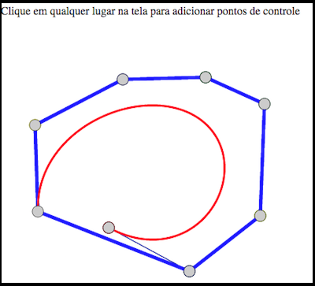

# Visualização Interativa do Invólucro Convexo de Curvas de Bézier:

Descrição: o usuário entra via mouse com os pontos de controle de uma curva de Bézier. O número de pontos de controle é arbitrário, sem limite. O sistema desenha a curva de Bézier e o correspondente invólucro convexo, em tempo real, pois o usuário poderá mover os pontos. As avaliações da curva deverão ser feitos obrigatoriamente com o Algoritmo de de Casteljau. 

# Referências

	* (Biblioteca Javascript D3) [https://d3js.org/]
	* (O algoritmo para encontrar o invólucro convexo) [http://geomalgorithms.com/a10-_hull-1.html]
